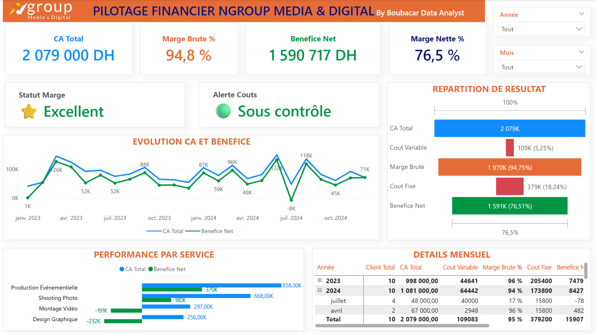
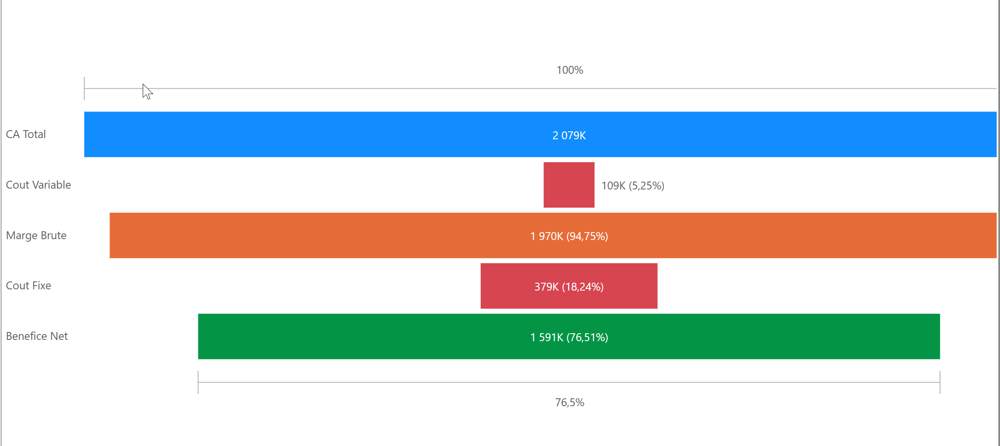

# 📊 Dashboard CA vs Rentabilité | Excel + Power BI

> Analyse complète de 24 mois de données financières avec dashboard interactif professionnel

[](https://powerbi.microsoft.com)
[](https://www.microsoft.com/excel)
[](https://dax.guide)
[](LICENSE)



---

## 🎯 Problématique Business

**40% des entrepreneurs font du chiffre d'affaires... mais ne gagnent PAS d'argent.**

Ils confondent :
- 💰 **Chiffre d'Affaires** (l'argent qui ENTRE)
- 💸 **Rentabilité** (l'argent qui RESTE)

Entre les deux, il y a les **COÛTS**.

Ce projet démontre comment construire un système complet de pilotage financier pour :
- ✅ Suivre 7 KPIs critiques en temps réel
- ✅ Détecter automatiquement les mois problématiques
- ✅ Identifier où part chaque dirham
- ✅ Prendre des décisions basées sur la data

---

## 📈 Résultats Clés du Projet

### **Performance Globale (24 mois)**

| Indicateur | Valeur | Statut |
|------------|--------|--------|
| **CA Total** | 2 079 000 MAD | ✅ |
| **Bénéfice Net** | 1 590 717 MAD | ✅ |
| **Marge Nette Moyenne** | 76.5% | ⭐ Excellent |
| **Coûts Variables** | 109 083 MAD | 🟢 Sous contrôle |
| **Coûts Fixes** | 379 200 MAD | 🟢 Maîtrisés |

### **Cas d'Étude : Juillet 2024 (Mois Catastrophe)**

| Indicateur | Janvier 2024 | Juillet 2024 | Évolution |
|------------|--------------|--------------|-----------|
| **CA** | 105 000 MAD | 48 000 MAD | -54% 🔴 |
| **Coûts Variables** | 2 300 MAD | 40 000 MAD | +1639% 🔴 |
| **Bénéfice Net** | 86 900 MAD | -7 800 MAD | -109% 🔴 |
| **Marge Nette** | 82.8% ⭐ | -16.2% 🔴 | -99 points |

**Cause identifiée :** Campagne marketing non-rentable (40K investis pour 48K de CA généré)

**Décision business :** Arrêt immédiat de ce type de campagne, ROI négatif détecté par le dashboard

---

## 🎥 Vidéo Tutoriel Complète

[](https://youtu.be/AUYo3agdDWY)

**Durée :** 43 minutes | **Langue :** Français

### **⏱️ Timestamps**

| Temps | Section | Contenu |
|-------|---------|---------|
| **00:00** | Introduction | Problématique : CA ≠ Rentabilité |
| **01:00** | Théorie | CA vs Rentabilité + Schéma P&L |
| **03:00** | Fichier Excel | Structure 5 onglets (Ventes, Dépenses, Parametres) |
| **06:00** | Import Power BI | Modèle relationnel + Table Calendrier |
| **09:50** | Mesures DAX | 7 KPIs + 2 Alertes conditionnelles |
| **15:00** | Dashboard Design | Cartes KPI, Waterfall, Évolution, Filtres |
| **38:00** | Analyse Business | Comparaison Janvier vs Juillet 2024 |
| **42:20** | Conclusion | Fichiers gratuits + Prochaine vidéo |

---

## 📁 Structure du Projet
```
Dashboard-CA-Rentabilite/
├── 📄 README.md                               (Ce fichier)
├── 📊 Excel/
│   ├── Pilotage_Financier_Ngroup.xlsx         (Fichier source complet)
├── 📈 PowerBI/
│   ├── Dashboard_CA_Rentabilite.pbix          (Dashboard complet)
├── 📚 Documentation/
│   ├── Guide_Complet.pdf                      (Guide étape par étape)
│   ├── Formules_DAX.txt                       (9 mesures documentées)
│   └── Analyses_Business.md                   (Insights détaillés)
├── Dashboard_CA_vs_Rentabilité.png            (Capture dashboard)
```

---

## 🛠️ Technologies Utilisées

| Technologie | Version | Usage |
|-------------|---------|-------|
| **Microsoft Excel** | 365 / 2021+ | Structuration données (233 lignes) |
| **Power BI Desktop** | Dernière version | Dashboard interactif |
| **DAX** | Natif Power BI | 9 mesures calculées |
| **Power Query** | Natif Power BI | Import & nettoyage |

**💡 100% Gratuit** - Aucune licence payante requise

---

## 📊 Données du Projet

### **Volumétrie**

- **233 lignes de données** (126 ventes + 107 dépenses)
- **24 mois d'historique** (Janvier 2023 → Décembre 2024)
- **5 onglets Excel structurés**
- **3 tables Power BI** (Ventes, Depenses, Calendrier)

### **Structure Fichier Excel**

#### **Onglet 1 : PARAMETRES**
```
Paramètres configurables :
- Devise : MAD
- Année d'analyse : 2024
- Seuil alerte cash : 20 000 MAD
- TVA : 20%
- Objectifs CA et Cash
```

#### **Onglet 2 : VENTES (126 lignes)**

| Colonne | Type | Description |
|---------|------|-------------|
| `Date_Facture` | Date | Date de la vente |
| `Invoice_ID` | Texte | Numéro facture (INV-001...) |
| `Client` | Texte | Client A, B, C... (anonymisés) |
| `Produit` | Texte | Shooting Photo, Montage Vidéo, etc. |
| `Quantite` | Nombre | Quantité vendue |
| `Prix_Unitaire` | Nombre | Prix par unité |
| `Montant_HT` | Formule | `=Quantite * Prix_Unitaire` |
| `TVA` | Formule | `=Montant_HT * 0.2` |
| `Montant_TTC` | Formule | `=Montant_HT + TVA` |
| `Date_Paiement_Prevue` | Date | Échéance prévue |
| `Date_Paiement_Reelle` | Date | Paiement effectif |
| `Statut_Paiement` | Texte | Payé / En attente / Retard |

#### **Onglet 3 : DEPENSES (107 lignes)**

| Colonne | Type | Description |
|---------|------|-------------|
| `Date_Depense` | Date | Date de la dépense |
| `Expense_ID` | Texte | Identifiant (EXP-001...) |
| `Fournisseur` | Texte | Nom fournisseur |
| `Type_Cout` | Texte | **FIXE** ou **VARIABLE** |
| `Categorie` | Texte | Loyer, Salaires, Marketing, Matériel |
| `Montant` | Nombre | Montant dépense |
| `Date_Paiement` | Date | Date paiement effectué |

**🔑 Colonne critique :** `Type_Cout` permet de différencier coûts fixes vs variables

---

## 🧮 Mesures DAX (9 Mesures)

### **7 KPIs Principaux**
```dax
// 1. CA Total
CA_Total = SUM(Ventes[Montant_HT])

// 2. Coûts Variables
Coûts_Variables = 
CALCULATE(
    SUM(Depenses[Montant]),
    Depenses[Type_Cout] = "Variable"
)

// 3. Coûts Fixes
Coûts_Fixes = 
CALCULATE(
    SUM(Depenses[Montant]),
    Depenses[Type_Cout] = "Fixe"
)

// 4. Marge Brute
Marge_Brute = [CA_Total] - [Coûts_Variables]

// 5. Marge Brute %
Marge_Brute_% = DIVIDE([Marge_Brute], [CA_Total], 0)

// 6. Bénéfice Net
Bénéfice_Net = [Marge_Brute] - [Coûts_Fixes]

// 7. Marge Nette %
Marge_Nette_% = DIVIDE([Bénéfice_Net], [CA_Total], 0)
```

### **2 Alertes Conditionnelles**
```dax
// 8. Statut Marge (Alerte visuelle)
Statut_Marge = 
VAR Marge = [Marge_Nette_%]
RETURN
SWITCH(
    TRUE(),
    Marge < 0.10, "🔴 Fragile",
    Marge < 0.20, "🟠 Correct",
    Marge < 0.30, "🟡 Bon",
    Marge < 0.40, "🟢 Très Bon",
    "⭐ Excellent"
)

// 9. Alerte Coûts Variables
Alerte_Couts = 
VAR Ratio = DIVIDE([Coûts_Variables], [CA_Total], 0)
RETURN
SWITCH(
    TRUE(),
    Ratio > 0.50, "🔴 Coûts trop élevés",
    Ratio > 0.30, "🟠 Surveiller",
    "🟢 Sous contrôle"
)
```

---

## 📊 Composants du Dashboard

### **1. Cartes KPI (4 indicateurs)**

- **CA Total** : 2 079 000 MAD (Bleu #4472C4)
- **Marge Brute %** : 96.6% (Orange #EB601B)
- **Bénéfice Net** : 1 590 717 MAD (Vert #70AD47)
- **Marge Nette %** : 76.5% (Gris foncé)

### **2. Alertes Automatiques (2 cartes)**

- **Statut Marge** : ⭐ Excellent / 🟢 Bon / 🟠 Attention / 🔴 Danger
- **Alerte Coûts** : 🟢 Sous contrôle / 🟠 Surveiller / 🔴 Trop élevés

### **3. Graphique Évolution (Ligne)**

- **Axe X** : Mois-Année (Jan 2023 → Déc 2024)
- **Axe Y** : CA Total, Bénéfice Net
- **Insight** : Visualise la croissance et détecte Juillet 2024 (chute)

### **4. Graphique Entennoir**




**Couleurs :**
- Verte : Gains (Benefice Net)
- Rouge : Pertes (Coûts Variables, Coûts Fixes)
- Orange : Gains avant déduction de toutes les dépenses
- Bleue : Gains ( Chiffre d'affaire total )

### **5. Analyse par Service (Barres horizontales)**

- **Marge Nette %** par type de service
- **Tri** : Du plus rentable au moins rentable
- **Utilité** : Identifier services à développer vs optimiser

### **6. Filtres Interactifs (Slicers)**

- **Filtre Année** : 2023, 2024
- **Filtre Mois** : Janvier → Décembre
- **Impact** : Dashboard se met à jour dynamiquement

---

## 🔍 Analyses Business Réalisées

### **Analyse 1 : Performance Globale (24 mois)**

**Constat :**
- Business **très rentable** (76.5% marge nette)
- Croissance **stable** avec **1 exception critique** (Juillet 2024)
- Coûts Variables **bien maîtrisés** (3.4% du CA)

**Recommandation :**
✅ Maintenir la structure actuelle
✅ Dupliquer stratégie Janvier 2024 (mois le plus rentable)

---

### **Analyse 2 : Juillet 2024 (Mois Catastrophe)**

#### **Chiffres**

| Indicateur | Valeur | vs Janvier |
|------------|--------|------------|
| CA | 48 000 MAD | -54% 🔴 |
| Coûts Variables | 40 000 MAD | +1639% 🔴 |
| Coûts Fixes | 15 800 MAD | = |
| Bénéfice Net | -7 800 MAD | -109% 🔴 |
| Marge Nette | -16.2% | -99 pts 🔴 |

#### **Cause Identifiée**

**Campagne marketing massive :**
- Investissement : 40 000 MAD
- CA généré : 48 000 MAD
- ROI : **-16.2%** (catastrophique)
- Ratio Coûts/CA : **83%** (seuil critique > 50%)

#### **Alertes Dashboard Activées**

🔴 **Statut Marge** : Fragile  
🔴 **Alerte Coûts** : Coûts trop élevés

#### **Décisions Business**

❌ **Arrêt immédiat** de ce type de campagne  
✅ **Analyse post-mortem** : Pourquoi le ROI est négatif ?  
✅ **Test A/B obligatoire** avant gros investissement marketing  
✅ **Budget marketing maximum** : 5% du CA prévisionnel  

---

### **Analyse 3 : Janvier 2024 (Mois Exemplaire)**

#### **Chiffres**

| Indicateur | Valeur | Statut |
|------------|--------|--------|
| CA | 105 000 MAD | ✅ |
| Coûts Variables | 2 300 MAD | 🟢 2.2% du CA |
| Coûts Fixes | 15 800 MAD | 🟢 Normaux |
| Bénéfice Net | 86 900 MAD | ✅ |
| Marge Nette | **82.8%** | ⭐ Excellent |

#### **Facteurs de Succès**

✅ CA élevé (105K)  
✅ Coûts Variables ultra-maîtrisés (2.3K seulement)  
✅ Marketing efficace à petit budget  
✅ Pas de dépenses exceptionnelles  

#### **Recommandations Stratégiques**

📌 **Répliquer ce modèle :**
- Maintenir CA autour de 100K/mois
- Budget marketing < 3K sauf ROI prouvé
- Focus sur services à forte marge

---

##  Installation & Utilisation

### **Prérequis**
```
✅ Microsoft Excel (2016+ ou Office 365)
✅ Power BI Desktop (gratuit)
   → Télécharger : https://powerbi.microsoft.com/desktop/
✅ Windows 10/11 ou macOS (Excel Online compatible)
```

### **Étape 1 : Télécharger les Fichiers**
```bash
# Cloner le repository
git clone https://github.com/bouba02/Dashboard-CA-Rentabilite.git

# Ou télécharger le ZIP
# → Code > Download ZIP
```

### **Étape 2 : Ouvrir Excel**

1. Ouvrir `Pilotage_Financier_Ngroup.xlsx`
2. Vérifier les 5 onglets (Parametres, Ventes, Depenses, Cash_Flow, Dashboard_Excel)
3. ✅ Les formules sont déjà configurées

### **Étape 3 : Ouvrir Power BI**

1. Lancer **Power BI Desktop**
2. Ouvrir `PowerBI/Dashboard_CA_Rentabilite.pbix`
3. Les données sont déjà importées et le dashboard prêt ✅

### **Étape 4 : Explorer le Dashboard**

- Utiliser les filtres **Année** et **Mois**
- Cliquer sur les graphiques (drill-down)
- Observer les alertes conditionnelles

---

## 🔄 Adapter à Vos Données

### **Option 1 : Remplacer les Données Excel**
```
1. Ouvrir Pilotage_Financier_Ngroup.xlsx
2. Remplir onglet VENTES avec vos factures
3. Remplir onglet DEPENSES avec vos coûts
4. Importer dans Power BI
5. Rafraîchir (Actualiser)
```

### **Option 2 : Connecter à Votre Base de Données**
```
Power BI Desktop
→ Accueil
→ Obtenir des données
→ MySQL / SQL Server / PostgreSQL
→ Entrer connexion
→ Sélectionner tables
→ Charger
```

### **Option 3 : Intégration API**
```
Power Query M
→ Connexion API REST
→ Transformation JSON
→ Chargement automatique
```

---

## 📖 Documentation Complémentaire

| Document | Description | Lien |
|----------|-------------|------|
| **Guide Complet** | 20 pages, étape par étape | [PDF](Documentation/Guide_Complet.pdf) |
| **Formules DAX** | 9 mesures documentées | [TXT](Documentation/Formules_DAX.txt) |
| **Analyses Business** | Insights détaillés | [MD](Documentation/Analyses_Business.md) |

---

## Compétences Développées

### **Data Analytics**

✅ Structuration données financières  
✅ Modélisation relationnelle (Star Schema)  
✅ ETL (Extract, Transform, Load)  
✅ Calculs DAX avancés (CALCULATE, DIVIDE, SWITCH, VAR)  

### **Business Intelligence**

✅ KPIs financiers (CA, Marges, Coûts)  
✅ Alertes automatiques conditionnelles  
✅ Data visualization (Waterfall, KPI cards, trends)  
✅ Storytelling data (comparaison mois, insights actionnables)  

### **Business Acumen**

✅ Analyse P&L (Profit & Loss)  
✅ Identification problèmes rentabilité  
✅ Recommandations stratégiques basées data  
✅ Pilotage financier opérationnel  

---

##  Cas d'Usage du Projet

### **Portfolio Data Analyst**

- ✅ Projet complet de bout en bout
- ✅ Démonstration compétences Excel + Power BI
- ✅ Business case réel avec impact mesurable
- ✅ GitHub repository documenté


### **Freelance / Consulting**

- ✅ Template réutilisable pour clients
- ✅ Personnalisation rapide (Excel + Power BI)
- ✅ Livrable professionnel immédiat
- ✅ Formation client incluse (vidéo)

### **Entrepreneuriat**

- ✅ Piloter votre propre business
- ✅ Suivre rentabilité mois par mois
- ✅ Détecter problèmes avant crise
- ✅ Prendre décisions éclairées

---

## 📞 Contact & Support

### **Créateur du Projet**

**Boubacar Nikiema**  
Data Analyst | Business Intelligence Expert

- 🌐 **Site** : [data.ngroupmediadigital.com](https://data.ngroupmediadigital.com)
- 📧 **Email** : nikiemaboubacar@gmail.com
- 💼 **LinkedIn** : [linkedin.com/in/boubacar-nikiema](https://linkedin.com/in/boubacar-nikiema)
- 🎥 **YouTube** : [@BoubacarDataAnalyst](https://youtube.com/@BoubacarDataAnalyst)
- 🐙 **GitHub** : [@bouba02](https://github.com/bouba02)

### **Besoin d'Aide ?**

- 💬 **Issues GitHub** : [Ouvrir une issue](https://github.com/bouba02/CA-vs-Rentabilit-Excel-Power-BI-Dashboard-Financier-Professionnel/issues)
- 📺 **Vidéo complète** : [YouTube (43 min)](https://youtu.be/AUYo3agdDWY)
- 📧 **Email direct** : nikiemaboubacar@gmail.com

**Temps de réponse moyen :** 24-48h

---

### **Vous êtes libre de :**

✅ Utiliser le projet pour un usage personnel  
✅ Utiliser le projet pour un usage commercial  
✅ Modifier le code/fichiers  
✅ Distribuer le projet  

### **Conditions :**

- Mentionner l'auteur original (Boubacar Nikiema)
- Inclure la licence MIT dans toute copie

---

## 🙏 Remerciements

- 🎥 **Communauté YouTube** pour le soutien et les retours
- 💼 **Microsoft** pour Power BI Desktop (gratuit)
- 📊 **DAX Guide** pour la documentation DAX
- 🌍 **Open Source Community** pour l'inspiration

---

## ⭐ Si Ce Projet Vous Aide

- **⭐ Star** ce repository
- **🔗 Partagez** avec vos collègues data/entrepreneurs
- **💬 Commentez** vos résultats sur YouTube
- **📧 Contactez-moi** pour des projets freelance

---

## 📈 Statistiques du Projet


---

**Made with ❤️  by Boubacar Nikiema**  
*© 2025 Ngroup Media & Digital - Tous droits réservés*

---

**Prêt à maîtriser votre rentabilité ? Téléchargez les fichiers et commencez maintenant !**

[⬇️ Download ZIP](https://github.com/bouba02/Dashboard-CA-Rentabilite/archive/refs/heads/main.zip) | [⭐ Star this repo](https://github.com/bouba02/bouba02/CA-vs-Rentabilit-Excel-Power-BI-Dashboard-Financier-Professionnel) | [📺 Watch Tutorial](https://youtu.be/AUYo3agdDWY)
